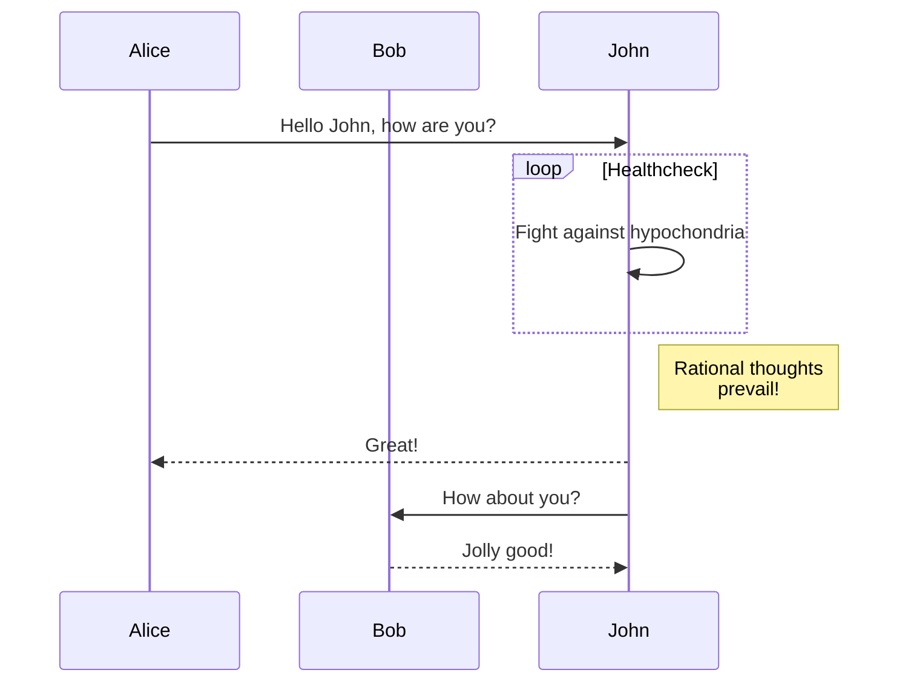
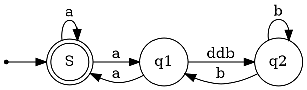

# Use VSCode to easily make technical document

VSCode Extensions :

* `Markdown Preview Enhanced` by *Yiyi Wang*
    - This extension do preview and export to PDF, style sheet is adjustable.
* `Graphviz Markdown Preview` by *Geek Learning*
    - draw flow chart, diagram
    - you must learn `dot language`
* `Markdown Preview Mermaid Support` by *Matt Bierner*
    - it same as `Graphviz Markdown Preview` but with sequence diagram
    - you must learn `Mermaid syntax`

## Markdown Preview Enhanced

### Style Sheet : Prefix Auto Increamental Number for Heading and Add watermark/icon

edit .style.less as content below

    ```css
    /* Please visit the URL below for more information: */
    /*   https://shd101wyy.github.io/markdown-preview-enhanced/#/customize-css */

    .markdown-preview.markdown-preview {
        // modify your style here
        // eg: background-color: blue;
        body {
        counter-reset: h2counter;
        counter-reset: h3counter;
        }
        h1 {
            counter-reset: h2counter;
        }
        h2 {counter-reset: h3counter;}
        h2:before {
            content: counter(h2counter) ".\0000a0\0000a0";
            counter-increment: h2counter;
        }
        h3:before {
            content: counter(h2counter) "." counter(h3counter) ".\0000a0\0000a0";
            counter-increment: h3counter;
        }
        h4 {font-size: medium;}
        img[alt="watermark"] {
            width: 1253px;
            height: 110px;
            transform: rotate(-50deg);
            opacity: 0.3;
            position: fixed;
            margin-top: 50%;

        }
        img[alt="ICON"] {
            width: 140px;
            height: 70px;
            opacity: 0.9;
            position: fixed;
            top: 0%;
            left: 0%;
        }
    }
    ```

and import it at begin of .md file by

    ```markdown
    @import ".style.less"
    
    

    # title

    content

    ## sub-title

    content

    ```

### Markdown Preview Mermaid Support

get more information, vist:

- https://mermaid-js.github.io/mermaid/#/  
- https://github.com/mjbvz/vscode-markdown-mermaid#readme

below is a simple example from official site



### Graphviz Markdown Preview

get more information, vist:

- https://graphviz.org/doc/info/lang.html  
- https://marketplace.visualstudio.com/items?itemName=geeklearningio.graphviz-markdown-preview

below is a simple example from official site



### Note

for code of `Graphviz Markdown Preview` and `Markdown Preview Mermaid Support`, do not indent, else it will be treated as raw code